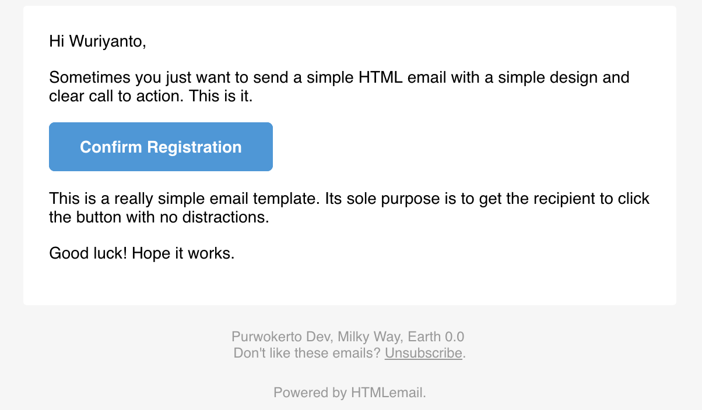

## go-email

[](https://travis-ci.org/wuriyanto48/goemail)

## Install

  ```shell
  $ go get https://github.com/wuriyanto48/goemail
  ```

## Result
  

### Usage

  - Example Html Email Template or using this awesome template https://github.com/leemunroe/responsive-html-email-template

    ```html
    <!DOCTYPE html PUBLIC "-//W3C//DTD XHTML 1.0 Transitional//EN"
            "http://www.w3.org/TR/xhtml1/DTD/xhtml1-transitional.dtd">
    <html>

    </head>

    <body>
    <p>
        Hi {{.Username}}
        <h4>Your Account Registration Success</h4>
        <p>Please follow link bellow, to complete your Registration</p>
        <a href="{{.URL}}">Confirm email address</a>
    </p>

    </body>

    </html>
    ```

  - Golang Code

    ```go
    package main

    import (
    	"fmt"

    	"github.com/wuriyanto48/goemail"
    )

    func main() {
    	authEmail := "wuriyanto007@gmail.com"
    	authPassword := "your password"
    	authHost := "smtp.gmail.com"
    	address := "smtp.gmail.com:587"
    	to := []string{"wuriyanto48@yahoo.co.id"}
    	from := "wuriyanto007@gmail.com"
    	subject := "Golang email"
    	body := "Golang email sent..."
    	email := goemail.New(to, address, from, subject, body, authEmail, authPassword, authHost)

    	emailData := struct {
    		Username string
    		URL      string
    	}{
    		Username: "Wuriyanto",
    		URL:      "wuriyanto.com",
    	}

    	err := execute(email, "template.html", emailData)
    	if err != nil {
    		fmt.Println(err)
    	}
    	fmt.Println("email sent")

    }

    func execute(u goemail.EmailSender, fileName string, data interface{}) error {
    	err := u.SetTemplate(fileName, data)
    	if err != nil {
    		return err
    	}

    	err = u.Send()
    	if err != nil {
    		return err
    	}

    	return nil
    }
    ```

# Authors
  - Lone Wolf https://github.com/wuriyanto48
